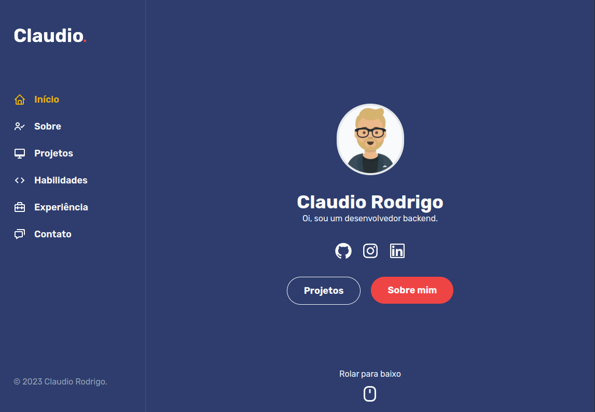

    

# Portfolio - Claudio Rodrigo 👨‍💻

## ✏️ Descrição
👨‍💻 Olá! Bem-vindo ao meu portfolio no GitHub. Sou Claudio Rodrigo, um desenvolvedor backend com experiência em projetos que utilizam Node.js e seus frameworks associados, como Express, Fastify e NestJS. Também tenho experiência em projetos front-end, trabalhando com ferramentas como ExtJS e ReactJS.

## 💼 Tecnologias utilizadas
* NextJS 
* TypeScript
* TailwindCSS
* ReactScroll
* ReactIcons
* AOS Animations

## 👨🏻‍💻 Como executar o projeto 

1. Clone o repositório para sua máquina local.
2. Certifique-se de ter o Node.js instalado.
3. Abra o terminal na pasta raiz do projeto.
4. Execute o comando `npm install` para instalar as dependências.
5. Execute o comando `npm run dev` para iniciar o servidor de desenvolvimento.
6. Acesse a aplicação em seu navegador através do endereço http://localhost:3000.

## 🚀 Demo
✨ Clique [aqui](https://claudiozh.vercel.app) para ver uma demonstração online do projeto.

